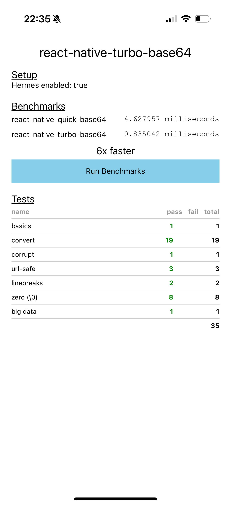
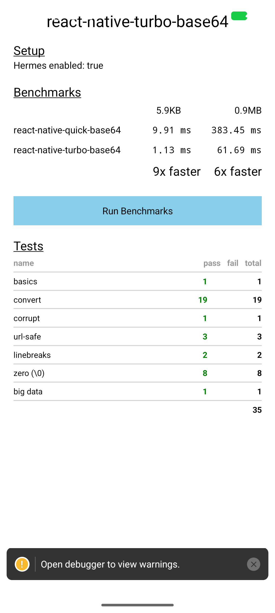

# ⚡ react-native-turbo-base64

**The fastest base64 encoding/decoding library for React Native**

Ultra-fast base64 operations powered by optimized C++ with JSI bindings. Built for performance-critical applications that need blazing-fast base64 encoding and decoding.

[](https://www.npmjs.com/package/react-native-turbo-base64)
[](https://github.com/pioner92/react-native-turbo-base64/blob/main/LICENSE)
[](https://github.com/pioner92/react-native-turbo-base64)

---

## 🚀 Why Choose This Library?

- **🏎️ Blazing Fast** - Up to **5x faster** than other native base64 libraries
- **⚡ Zero Bridge Overhead** - Direct JSI bindings eliminate React Native bridge bottleneck
- **🌐 URL-Safe Support** - Native support for URL-safe base64 encoding/decoding
- **📦 Small Bundle** - Minimal JavaScript footprint, heavy lifting done in native code
- **🔒 Type Safe** - Full TypeScript support with comprehensive type definitions
- **✅ Battle Tested** - Extensive test suite covering edge cases and compatibility

---

## 📊 Performance

Benchmark results

| iPhone                                            | Android                                             |
| ------------------------------------------------- | --------------------------------------------------- |
|  |  |


> 💡 **Performance scales with data size** - the larger your data, the more dramatic the improvement!

---

## 📦 Installation

```sh
npm install react-native-turbo-base64
```

or

```sh
yarn add react-native-turbo-base64
```

### iOS Setup

```sh
cd ios && pod install
```

### Android Setup

No additional steps required! The library will automatically link.

---

## 🎯 Quick Start

```typescript
import {
  fromByteArray,
  toByteArray,
  byteLength,
  trimBase64Padding
} from 'react-native-turbo-base64';

// 🔵 Encode to base64
const data = new Uint8Array([72, 101, 108, 108, 111]);
const encoded = fromByteArray(data);
console.log(encoded); // "SGVsbG8="

// 🔵 Decode from base64
const decoded = toByteArray('SGVsbG8=');
console.log(decoded); // Uint8Array [72, 101, 108, 108, 111]

// 🔵 Get byte length without decoding
const length = byteLength('SGVsbG8=');
console.log(length); // 5

// 🔵 URL-safe base64
const urlSafeEncoded = fromByteArray(data, true);
console.log(urlSafeEncoded); // Uses '-' and '_' instead of '+' and '/'
```

---

## 📖 API Reference

### `fromByteArray(uint8: Uint8Array, urlSafe?: boolean): string`

Encodes a `Uint8Array` to a base64 string.

**Parameters:**
- `uint8` - The byte array to encode
- `urlSafe` (optional) - Use URL-safe encoding (replaces `+/` with `-_` and omits padding)

**Returns:** Base64 encoded string

**Example:**
```typescript
const bytes = new Uint8Array([255, 254, 253]);
const standard = fromByteArray(bytes); // "//79"
const urlSafe = fromByteArray(bytes, true); // "__79"
```

---

### `toByteArray(input: string, removeLinebreaks?: boolean): Uint8Array`

Decodes a base64 string to a `Uint8Array`.

**Parameters:**
- `input` - The base64 string to decode
- `removeLinebreaks` (optional) - Remove `\n` and `\r` before decoding

**Returns:** Decoded byte array

**Example:**
```typescript
const decoded = toByteArray('SGVsbG8=');
console.log(decoded); // Uint8Array [72, 101, 108, 108, 111]

// Handle base64 with linebreaks
const withLinebreaks = 'SGVs\nbG8=';
const cleaned = toByteArray(withLinebreaks, true);
```

**Throws:** `Error` if input is not valid base64

---

### `byteLength(b64: string): number`

Calculates the byte length of a base64 string **without decoding**.

**Parameters:**
- `b64` - The base64 string

**Returns:** Number of bytes the decoded data would be

**Example:**
```typescript
const length = byteLength('SGVsbG8=');
console.log(length); // 5 (much faster than decoding)
```

---

### `trimBase64Padding(str: string): string`

Removes trailing padding characters (`=`) from a base64 string.

**Parameters:**
- `str` - The base64 string

**Returns:** String without padding

**Example:**
```typescript
const padded = 'SGVsbG8=';
const trimmed = trimBase64Padding(padded);
console.log(trimmed); // "SGVsbG8"
```

## 🎨 Advanced Examples

### Working with Images

```typescript
import { toByteArray, fromByteArray } from 'react-native-turbo-base64';
import RNFS from 'react-native-fs';

// Load and decode base64 image
async function loadImage(base64Data: string) {
  const imageBytes = toByteArray(base64Data);
  const path = `${RNFS.CachesDirectoryPath}/image.jpg`;
  await RNFS.writeFile(path, imageBytes, 'base64');
  return path;
}

// Encode image to base64
async function encodeImage(filePath: string) {
  const fileData = await RNFS.readFile(filePath, 'base64');
  const bytes = toByteArray(fileData);
  return fromByteArray(bytes);
}
```

### Processing Large Files

```typescript
import { toByteArray, fromByteArray } from 'react-native-turbo-base64';

// Efficiently process large base64 data
function processLargeFile(base64String: string) {
  // Decode (fast!)
  const bytes = toByteArray(base64String);

  // Process bytes...
  const processed = bytes.map(byte => byte ^ 0xFF); // Example: invert bits

  // Encode back (still fast!)
  return fromByteArray(new Uint8Array(processed));
}
```

### API Requests with Base64 Bodies

```typescript
import { fromByteArray, toByteArray } from 'react-native-turbo-base64';

// Send binary data as base64
async function uploadBinaryData(data: Uint8Array) {
  const base64 = fromByteArray(data);

  const response = await fetch('https://api.example.com/upload', {
    method: 'POST',
    headers: { 'Content-Type': 'application/json' },
    body: JSON.stringify({ data: base64 })
  });

  return response.json();
}

// Receive binary data as base64
async function downloadBinaryData() {
  const response = await fetch('https://api.example.com/download');
  const { data } = await response.json();

  return toByteArray(data); // Returns Uint8Array
}
```

### Crypto Integration

```typescript
import { toByteArray, fromByteArray } from 'react-native-turbo-base64';
import * as Crypto from 'expo-crypto';

async function encryptAndEncode(plaintext: string) {
  // Encrypt
  const encrypted = await Crypto.digestStringAsync(
    Crypto.CryptoDigestAlgorithm.SHA256,
    plaintext,
    { encoding: Crypto.CryptoEncoding.HEX }
  );

  // Convert hex to bytes
  const bytes = new Uint8Array(
    encrypted.match(/.{1,2}/g)!.map(byte => parseInt(byte, 16))
  );

  // Encode to base64 for transmission
  return fromByteArray(bytes);
}
```

---

## 🔥 Features

- ✅ **Standard & URL-safe base64** - Full RFC 4648 compliance
- ✅ **Linebreak handling** - Automatically remove `\n` and `\r` during decode
- ✅ **Padding tolerance** - Handles missing or misplaced padding gracefully
- ✅ **TypeScript first** - Complete type definitions included
- ✅ **Zero dependencies** - No runtime dependencies except React Native
- ✅ **JSI direct bindings** - Bypass the bridge entirely
- ✅ **Memory efficient** - Optimized memory usage for large data
- ✅ **Works with Expo** - Compatible with Expo dev builds

---

## 🆚 Comparison with react-native-quick-base64

| Feature | react-native-turbo-base64 | react-native-quick-base64 |
|---------|--------------------------|---------------------------|
| **Speed** | ⚡⚡⚡⚡⚡ Fastest | ⚡⚡⚡ Fast |
| **JSI Bindings** | ✅ | ✅ |
| **URL-safe Support** | ✅ | ✅ |
| **TypeScript** | ✅ | ✅ |
| **Bundle Size** | 🟢 Small | 🟢 Small |
| **Native Code** | C++ (highly optimized) | C++ |

---

## 🏗️ How It Works

This library uses several optimization techniques:

1. **JSI Direct Bindings** - Functions are installed directly on the JavaScript global object, eliminating bridge serialization overhead
2. **Cache-Aligned Tables** - Lookup tables are aligned to 64-byte boundaries for L1 cache efficiency
3. **Branch Prediction Hints** - Uses `[[likely]]`/`[[unlikely]]` attributes for optimal branch prediction
4. **Zero-Copy Operations** - Direct memory access to ArrayBuffers without copying when possible
5. **Optimized Hot Paths** - Fast path for common cases (99.9%), slow path only for edge cases

---

## 🐛 Troubleshooting

### "encodeBase64FromArrayBuffer is not a function"

Make sure the native module is properly installed and linked:

```sh
# iOS
cd ios && pod install

# Clean build
cd .. && yarn example ios --simulator="iPhone 15"
```

### TypeScript errors

Ensure you have the latest version installed and TypeScript can find the types:

```json
// tsconfig.json
{
  "compilerOptions": {
    "moduleResolution": "node"
  }
}
```

### Performance not as expected?

- Ensure you're running a **release build** (debug builds have overhead)
- Check you're testing with realistic data sizes (>1KB)
- Verify no other libraries are intercepting base64 operations

---

## 🤝 Contributing

Contributions are welcome! Please see [CONTRIBUTING.md](CONTRIBUTING.md) for details.

### Development Setup

```sh
# Clone the repo
git clone https://github.com/pioner92/react-native-turbo-base64.git
cd react-native-turbo-base64

# Install dependencies
yarn

# Run example app
yarn example ios
# or
yarn example android
```

---

## 📄 License

MIT © [Alex Shumihin](https://github.com/pioner92)

---

## 🙏 Acknowledgments

- Inspired by [base64-js](https://github.com/beatgammit/base64-js) and [react-native-quick-base64](https://github.com/craftzdog/react-native-quick-base64)
- Built with [create-react-native-library](https://github.com/callstack/react-native-builder-bob)

---

## ⭐ Show Your Support

If this library helps your project, please give it a ⭐ on [GitHub](https://github.com/pioner92/react-native-turbo-base64)!

---

**Made with ❤️ for the React Native community**
